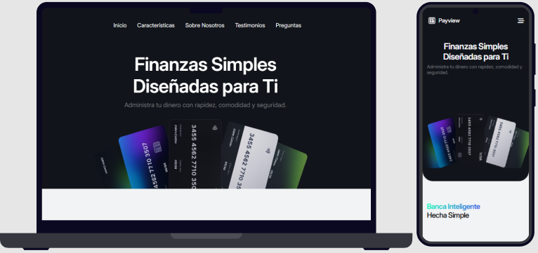

# Landing Bancaria

Landing page profesional para plataforma bancaria moderna, diseñada con HTML5, CSS3 y JavaScript vanilla. Interfaz elegante y responsive que presenta servicios financieros de manera atractiva y profesional.

## Tabla de Contenidos

- [Características](#características)
- [Capturas de Pantalla](#capturas-de-pantalla)
- [Tecnologías](#tecnologías)
- [Requisitos Previos](#requisitos-previos)
- [Instalación](#instalación)
- [Demo](#demo)
- [Estructura del Proyecto](#estructura-del-proyecto)
- [Funcionalidades](#funcionalidades)
- [Agradecimientos](#agradecimientos)

## Características

- Diseño completamente responsive adaptable a todos los dispositivos
- Interfaz moderna y profesional siguiendo las mejores prácticas de UI/UX
- Animaciones fluidas y transiciones suaves
- Navegación intuitiva con scroll suave entre secciones
- Presentación clara de servicios y beneficios bancarios
- Optimizada para SEO con estructura semántica HTML5
- Desarrollada con JavaScript puro sin dependencias de frameworks
- Carga rápida y rendimiento optimizado
- Menú hamburguesa para dispositivos móviles

## Capturas de Pantalla



## Tecnologías

- **HTML5**: Estructura semántica y accesible
- **CSS3**: Estilos modernos con Flexbox y Grid Layout
- **JavaScript Vanilla**: Interactividad y funcionalidades dinámicas
- **Font Awesome**: Iconos vectoriales 
- **Google Fonts**: Tipografías personalizadas 

## Requisitos Previos

Antes de comenzar, asegúrate de tener:

- Navegador web moderno (Chrome, Firefox, Edge, Safari)
- Editor de código (VS Code, Sublime Text, etc.) - opcional
- [Git](https://git-scm.com/) para clonar el repositorio
- Live Server (opcional, para desarrollo local)

## Instalación

Sigue estos pasos para instalar y ejecutar el proyecto localmente:

1. **Clona el repositorio**
```bash
git clone https://github.com/brayanhl17/Landing-bancaria.git
```

2. **Navega al directorio del proyecto**
```bash
cd Landing-bancaria
```

3. **Abre el proyecto**

Opción 1 - Abrir directamente:
```bash
# Abre index.html en tu navegador
# Doble clic en el archivo o arrastra a tu navegador
```

Opción 2 - Usar Live Server (VS Code):
```bash
# Instala la extensión Live Server en VS Code
# Clic derecho en index.html > Open with Live Server
```

4. **Accede a la aplicación**
```
http://localhost:5500
# o simplemente abriendo index.html directamente
```

## Demo

Prueba la aplicación en vivo sin necesidad de instalar nada:

**[Ver Demo en Vivo](https://brayanhl17.github.io/Landing-bancaria)**

### Configurar GitHub Pages

Para publicar tu propia versión:

1. Ve a Settings de tu repositorio en GitHub
2. Selecciona la sección "Pages" en el menú lateral
3. En "Source", selecciona la rama `main` y la carpeta `/ (root)`
4. Guarda los cambios y espera unos minutos
5. Tu sitio estará disponible en: `https://tuusuario.github.io/Landing-bancaria/`

## Estructura del Proyecto

```
Landing-bancaria/
│
├── index.html             # Página principal
│
├── css/
│   ├── styles.css         # Estilos principales
│
├── js/
│   ├── script.js          # JavaScript principal
│
├── img/                   # Imágenes del proyecto
│
└── README.md              # Este archivo
```

## Funcionalidades

### Sección Hero
- Banner principal con imagen de fondo impactante
- Llamados a la acción (CTA) destacados
- Titulares atractivos y descriptivos
- Botones de registro e información
- Diseño optimizado para conversión

### Servicios Bancarios
- Grid responsivo de tarjetas de servicios
- Iconos descriptivos para cada servicio
- Descripciones claras y concisas
- Efectos hover interactivos
- Organización visual jerárquica

### Características y Beneficios
- Presentación de ventajas competitivas
- Diseño en grid adaptable
- Animaciones al hacer scroll
- Estadísticas y números destacados
- Contenido persuasivo y directo

### Sección de Testimonios
- Reseñas de clientes satisfechos
- Carrusel de testimonios
- Calificaciones visuales
- Fotografías de clientes
- Diseño creíble y profesional

### Navegación
- Menú fijo en la parte superior
- Scroll suave entre secciones
- Menú hamburguesa responsive
- Indicador de sección activa
- Transiciones suaves

### Footer
- Enlaces a redes sociales
- Información de contacto
- Navegación rápida por secciones
- Derechos de autor
- Diseño organizado en columnas

### Características Técnicas
- Sistema de navegación con smooth scroll
- Lazy loading de imágenes para mejor rendimiento
- Animaciones CSS al hacer scroll
- Formulario con validación JavaScript
- Menú mobile completamente funcional
- Optimización para SEO
- Meta tags para redes sociales
- Compatibilidad cross-browser

## Agradecimientos

- A Roberto Andrade por la insppiración para el diseño
- A Font Awesome por su biblioteca de iconos
- A Google Fonts por las tipografías de calidad

---

⭐ Si este proyecto te fue útil, considera darle una estrella en GitHub

💬 ¿Tienes preguntas o sugerencias? Abre un [issue](https://github.com/brayanhl17/Landing-bancaria/issues)

Desarrollado con 💙 por [Brayan HL](https://github.com/brayanhl17)
